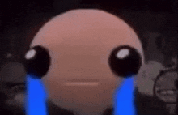
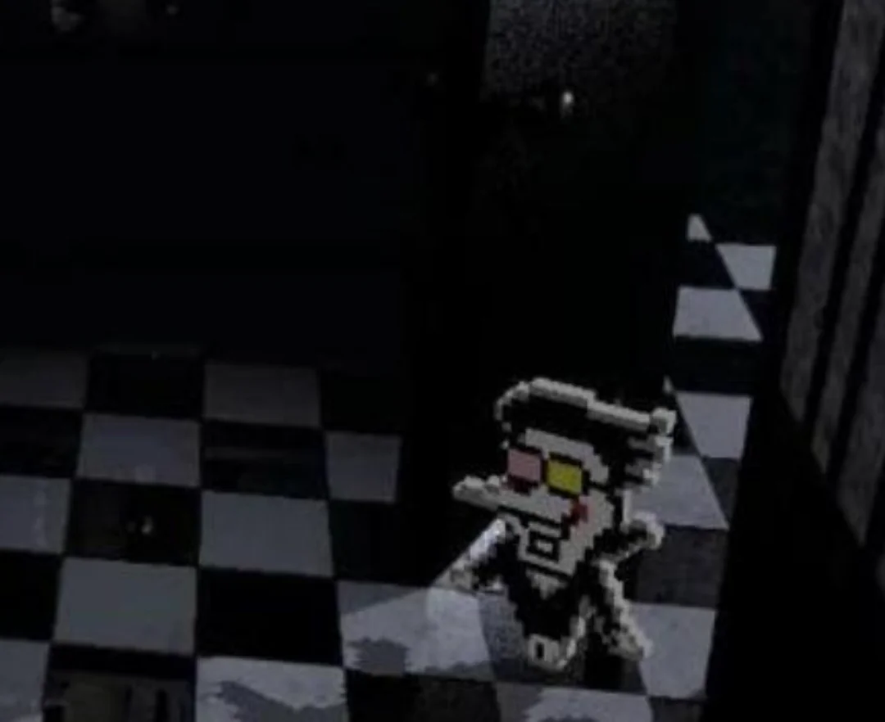
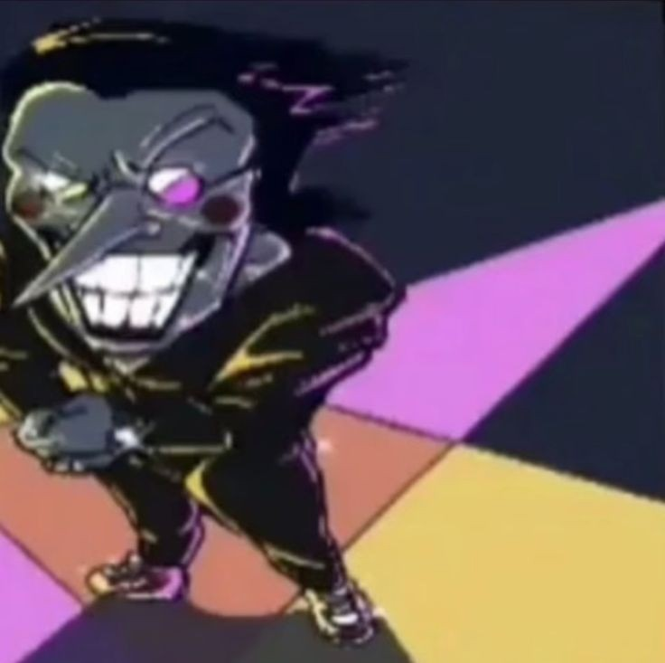
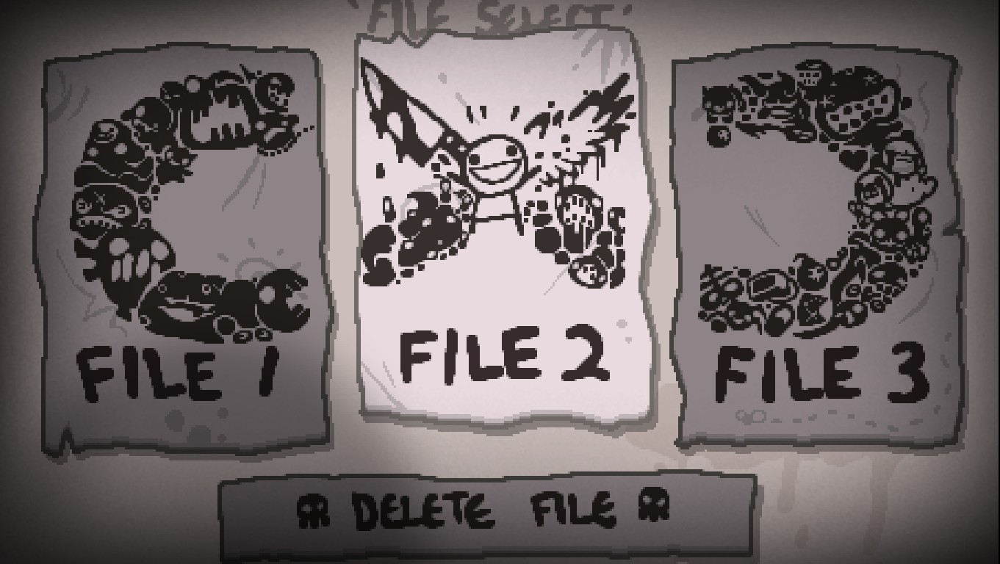

# TP0: Presentación en GitHub

Alo jelooo, me llamo Agustin Ezequiel Soriano (legajo: 2330301), tengo 19 años y estoy en mi segundo año de la carrera. No trabajo ni programo más allá de la facultad (*pero ojalá hacerlo pronto*).

 

## Personality traits:
- Amo los juegos indies, mis favoritos son:
    1. The Binding of Isaac: Repentance
    2. Terraria
    3. Hollow Knight
    4. Mewgenics!
    5. Hollow Knight: Silksong (*el GOTY fue un robo*)
    6. Deltarune
    7. Inscryption
    8. Slime Rancher
    9. Freddy Fazbear's Pizzeria Simulator

- Mi personaje favorito of all media es **Spamton G. Spamton** de Deltarune.

  

- Mi ítem favorito de calidad 4 de The Binding of Isaac: Repentance es "C Section".

- Después de siete años de haberlo abierto por primero vez pirateado, he conseguido el 3000000% de The Binding of Isaac: Repentance+.

- En cuanto a series, actualmente veo Jojo's Bizzare Adventure (*estoy por la parte 6*), The Amazing Digital Circus (*ya tengo entradas*), Helluva Boss y Hazbin Hotel (*gustos culposos*). Diría que mi peli favorita de todos los tiempos es El Extraño Mundo de Jack.

- Se me es complicado explicar mi gusto musical, o al menos nombrar géneros, asi que en lugar acá listo algunas canciones que lo describen más o menos (*sí, Will Wood es mi artista favorito*):
    - [BlackBoxWarrior - OKULTRA](https://youtu.be/zbUgoqu-tb4?si=HkZpq0Nr9z4qiOgV) - Will Wood
    - [Hand me my shovel, I'm going in!](https://youtu.be/lLd5OekWNOg?si=NdQqqUTTH3PrzTVC) - Will Wood
    - [Spring and a Storm](https://youtu.be/DehRu-4kgHY?si=34Q9qoM5Iy6v6NFG) - Tally Hall
    - [2econd 2ight 2eer](https://youtu.be/LTshg_CQLL4?si=60NGDHILXxKNPL9-) - Will Wood
    - [BIG SHOT](https://youtu.be/V31PVkwzpEY?si=3gL51CNVN_8zbel9) - Toby Fox
    - [Crazy Days](https://youtu.be/7Ga0abXYYw0?si=fuvJSOID4tyxwncj) - Ridiculon

- Sé tocar el piano y amo escribir relatos de suspenso medio surreales (*obvio que tienen lore*), aunque estos hobbies los tengo un poco olvidados por la facultad.

- Pastafrola: la que haya.

Adjunto una foto del año pasado en el Torreón del Monje, Mar del Plata (*felicidad pre-primeros parciales*). Nos vemos en claseee

